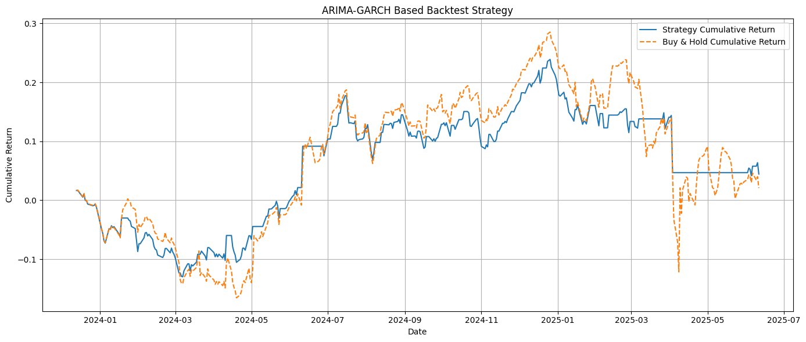

# ARIMA-GARCH Based Stock Forecasting, Risk Estimation, and Backtesting

This project explores time series forecasting, risk management, and trading strategies using **ARIMA-GARCH models**. It applies these models to **Apple Inc. (AAPL)** stock data from 2018 to 2025 and consists of three integrated Python scripts:

1. **stock_forecast_arima_garch.py** – Backtesting a trading strategy using ARIMA-GARCH and Value-at-Risk
2. **var_arima_garch_backtest.py** – Forecasting daily Value-at-Risk (VaR) and testing exceedances
3. **daily_var_exceedance_test.py** – Forecasting returns and price levels using ARIMA-GARCH with confidence intervals

---

## 📈 Project Objective

- To compare a model-driven strategy with a Buy & Hold baseline  
- To estimate financial risk using VaR and test its accuracy  
- To forecast future prices and volatility using statistical time series models  
- To visualize confidence intervals and tail risk

---

## 📘 Theoretical Background

### 1. ARIMA Model  
- **Autoregressive Integrated Moving Average** captures linear time series patterns.
- `ARIMA(p, d, q)` where:
  - `p`: number of autoregressive terms
  - `d`: differencing order (typically 0 for log-returns)
  - `q`: number of moving average terms
- Fitted using grid search over AIC values.

### 2. GARCH Model  
- **Generalized Autoregressive Conditional Heteroskedasticity** models time-varying volatility.
- We use `GARCH(1,1)` to forecast next-day volatility based on ARIMA residuals.
- This enables dynamic volatility estimation for risk control.

### 3. Value-at-Risk (VaR)  
- Quantifies maximum expected loss at a given confidence level (95% here).
- VaR is computed as: `VaR = μ + z × σ` where `μ` is the forecasted return, `σ` is volatility, and `z = -1.645`.

---

## 🧪 Scripts Overview

### 1. **stock_forecast_arima_garch.py**
- Performs a daily backtest over test set
- Forecasts returns and risk with ARIMA-GARCH
- Signals a `LONG` position when expected return is positive and VaR is within acceptable range
- `EXIT` if return forecast is negative, volatility is high, or VaR has been exceeded twice recently
- Computes:
  - Cumulative strategy return vs Buy & Hold
  - Sharpe Ratio
  - Max Drawdown

### 2. **var_arima_garch_backtest.py**
- Computes one-step-ahead 95% daily VaR
- Records how often actual return falls below VaR (i.e., exceedance)
- Tests if exceedance rate matches theoretical 5%
- Visualizes:
  - Actual return vs VaR line
  - Highlighted exceedance regions

### 3. **daily_var_exceedance_test.py**
- Forecasts 10-day cumulative returns and future prices
- Adds confidence intervals using GARCH-based volatility
- Visualizes:
  - Expected price path
  - 95% confidence bands
  - Current stock price

---

## 📊 Metrics and Evaluation

- **Cumulative Return** (Strategy vs Buy & Hold)
- **Sharpe Ratio** for risk-adjusted performance
- **Maximum Drawdown**
- **VaR Exceedance Rate** vs Theoretical Exceedance (5%)
- **Prediction Interval Visualization**

---

## 📁 Folder Structure

```bash
.
├── stock_forecast_arima_garch.py
├── var_arima_garch_backtest.py
├── daily_var_exceedance_test.py
└── README.md
```



